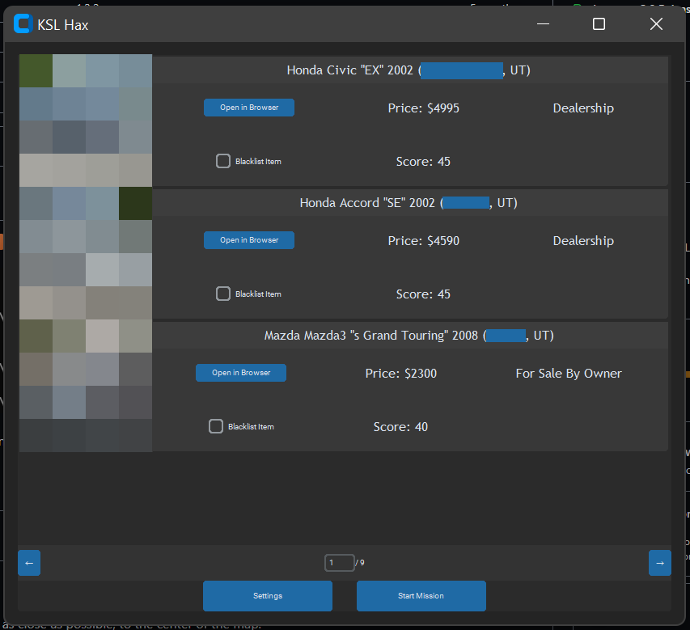

# KSL HAX


This program is used to crawl ksl classifieds (spelled correctly) cars, and
rank them according to a custom scoring system. 

# User Interface
The user interface is made simple, and easy to understand. Items are placed where they would be expected.
## Main Menu
### Empty

### Populated


*(Images are blurred and some names are blocked to protect my privacy, and so I don't store random people's data publicly for forever)*

The Main Menu consists of a few important elements:
 - The arrow keys allowing navigation through small pages.
 - A `Settings` button for allowing settings changes.
 - A `Start Mission` button to begin scraping the site.

When the main menu is populated, you get car objects that you can view. The titles of the cars are created like so:
```
Make Model "Trim" year (city, state)
```

## Settings


The Settings window allows you to manage important variables for scoring, as well as talking to KSL Cars.

### Scoring
The scoring section allows you to choose a script, as well as create a new script for scoring the cars. All scoring scripts are written in python, so writing code for them should not be too difficult.

To create your own script for scoring cars, press the plus button. Select the new script that appeared in the drop down (in most cases it will be called `scoring/new_scoring_method1.py`). From here, press the `Open Script` button. This should reveal the default window for editing python scripts through windows.

Go ahead and scroll down to an area that looks like this:

```python
score = 0

# Your operations

return score
```

The comment that states `Your operations` is where you can begin writing code that scores your cars. Your key to what properties are available are seen above.

A great example of a scoring method is seen below:
```python
score = 0

if item.make == "Ford" and item.makeYear >= 2010 and item.model == "Focus": return

if item.model in ["Corolla", "Camry", "Civic", "Accord", "Mazda3"]:
    score += 5

return score
```

In this example, we first remove all Ford focuses with transmission issues. In the second part, we give 5 points to all vehicles that are either a *Corolla*, a *Camry*, a *Civic*, an *Accord*, or a *Mazda3*.

If you write this in the script, save it, and use it, all of your Corollas, Camrys, Civics, Accords, and Mazda3s should show up at the top.

### Api

This is how the scraper communicates with KSL Cars. The first box with the URL is where you will paste the URL with all of your filters. The box to the right of that is how many pages the program will load from the API. If there are not that many pages, the scraper will stop scraping when it comes across an empty page.

**PLEASE NOTE THAT YOU SHOULD NOT LOAD TOO MANY PAGES, AS KSL CARS WILL BLOCK YOUR USER AGENT**

Below both of these boxes is one that contains the User Agent. This is how KSL Cars identifies you. If you ever get blocked by KSL Cars, simply tweak this value a little bit, and they should no longer be blocking you.

# Terms and Conditions

Please note that the use of this software may partially void the Terms of Use stated by KSL. This is an exerpt given by KSL Classified's Terms of Use as of June 27th, 2023:

```
 You may download, print or view individual pages at the Site for private, noncommercial use, provided you do not delete, change or otherwise modify any of the information displayed or accessible through the Site, including any copyright or trademark notices.
 ```

 This software DOES NOT manipulate content on KSL Cars, it simply views them. This program WILL NOT allow commercial use.

 The only somewhat questionable thing that this program does is temporarily cache the images for viewing purposes, which is explained here in the terms of use:

 ```
 You may store files that are automatically cached by your Web browser for display enhancement purposes.
 ```

 However, there is one thing that may cause this software to void the Terms of Use:

 ```
 Engage in the systematic retrieval of any of the materials on or accessible through our Site to create or compile, directly or indirectly, a collection, compilation, database, or directory without the prior written permission of Operator., all logos, names, package designs and marks on the Site are trademarks or service marks and may not be used without Operator’s prior written permission. Operator’s policy is to terminate the online privileges of individuals who repeatedly violate the copyrights of others.
 ```

 WE DO NOT STORE DATA FROM CLASSIFIED CARS, WE ONLY ENHANCE THE EXPERIENCE OF USING THEIR SITE.

 The creator of this program IS NOT responsible for your use of the program, and if you "get caught" during use of this program. USE THIS PROGRAM AT YOUR OWN RISK. 

 All copyright's and trademark's associated with the gathered data belongs to KSL, or the uploader. I DO NOT CLAIM ANY GATHERED INFORMATION.